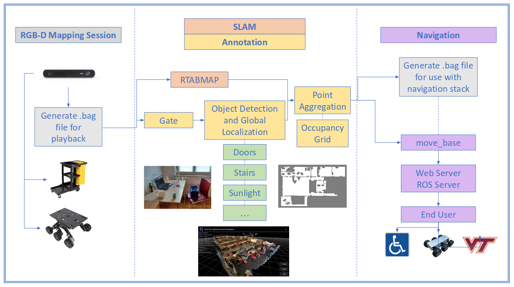
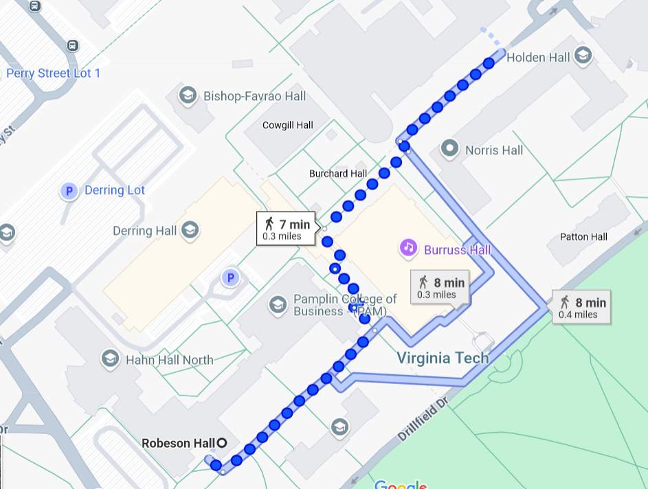

---
date:
  created: 2019-08-01
categories:
  - Projects
---

# Accessibility constraint mapping

Off-road navigation often involves difficult-to-traverse terrain or barriers, such as stairs, sidewalk curbs, construction sites, uneven pavement, etc. Global navigation planning provided by traditional mapping software (e.g. Google maps, Waze) does not typically account for such constraints, and may not be able to plan for unforeseen constraints that vary on a day-to-day basis such as temporary obstacles or path deteriorations. This project seeks to optimize path planning in light of variable off-road navigation constraints by building navigation maps in real-time using simultaneous localization and mapping (SLAM) software. Potential end-users of off-road navigation maps include autonomous rovers and handicapped persons.

**Fig 1.** Overview of the accessibility constraint mapping framework.

<!-- more -->

## Links

- [Code repository](https://github.com/eckelsjd/access_mapping.git) — robotic operating system (ROS) package and computer vision scripts

## Project highlights

**Fig 2.** An example off-road navigation map using Google maps.

- ZED camera real-time video feed for mapping off-road paths on Virginia Tech's campus
- Image processing with the `opencv` Python wrapper library
- Real-time object detection with the YOLOv3 neural network
- Integration with robotic operating system (ROS) and localization of objects with SLAM-based software
- Occupancy grid generation with off-road navigation constraints

## Contributions

- Integration of object detection neural network with ROS to update SLAM-based global navigation maps
- Automation of processing scripts to work in real-time with ZED camera video feed
- Placement of navigation constraints in an occupancy grid 

## Future work

As of writing, this project has many steps to go before realizing the full goal of off-road navigation path planning. First, an extensive training dataset of common off-road navigation constraints (construction sites, stairs, curbs, etc.) should be collected and the YOLO network should be trained to recognize these objects. Then, the new "constraint" YOLO network can be integrated into the existing workflow to plot the locations of constraints in a global occupancy grid. Finally, the occupancy grid should be integrated with existing path optimizers to actually produce off-road navigation paths that account for these off-road constraints.

A good test for this framework would be Virginia Tech's campus where inadequate support is provided for persons in wheelchairs navigating sidewalks without ADA-compliant curbs.