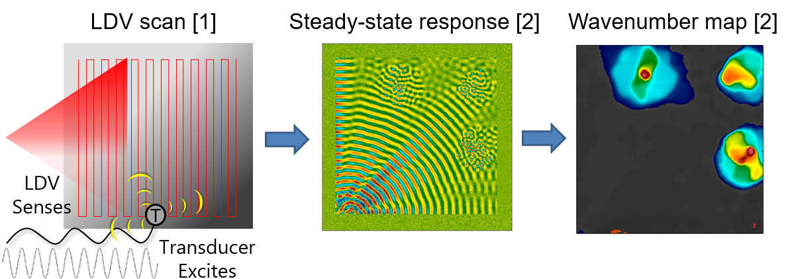
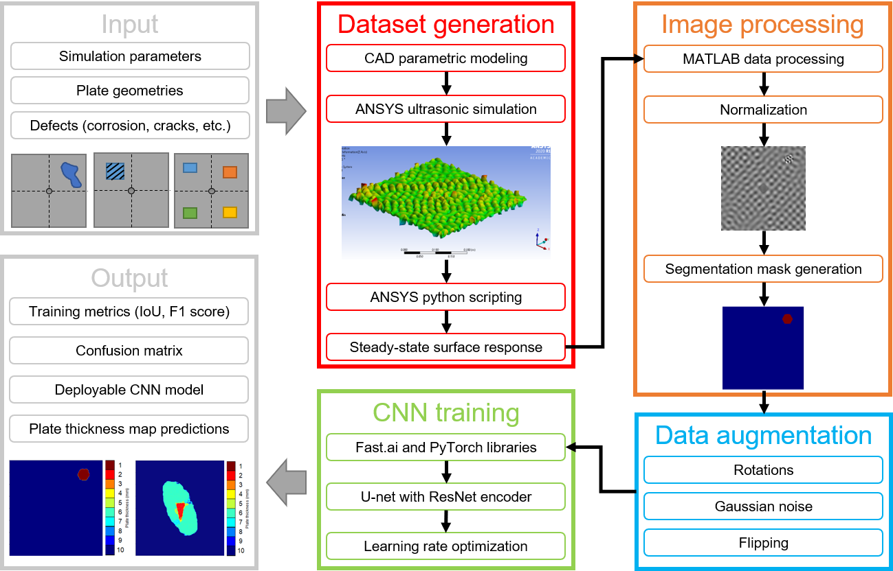
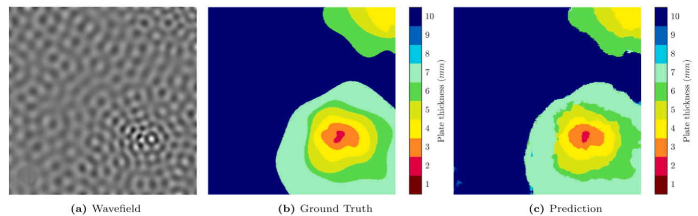
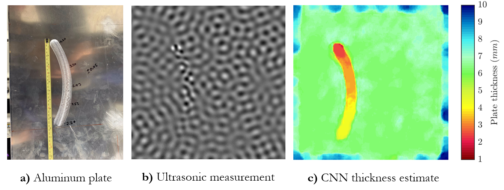

---
date:
  created: 2020-08-25
categories:
  - Projects
---

# Neural networks for ultrasonic defect detection

An ultrasonic transducer excites a plate-like structure to steady-state and a laser Doppler vibrometer (LDV) scanner obtains the surface velocity response. The wavenumber of the propagating waves is dependent on local changes in thickness of the plate, which indicates damage such as corrosion, cracking, or delamination. This project involved training a convolutional neural network (CNN) on simulated ultrasonic data to classify plate thickness and detect damages and defects. The CNN performed orders of magnitude faster than traditional processing methods and provided more accurate results.

**Fig 1.** The Acoustic Steady-State Excitation Spatial Spectroscopy (ASSESS) method.

<!-- more -->

## Links

- [Conference paper](https://doi.org/10.1007/978-3-030-76335-0_18) — initial CNN demonstration on ultrasonic data
- [Journal article](https://doi.org/10.1016/j.ultras.2021.106661) — experimental results published in _Ultrasonics_
- [Code repository](https://github.com/eckelsjd/DeepWaves.git) — source code with processing scripts and other documentation

## Project overview

**Fig 2.** Overview of the ultrasonic simulation and neural network processing workflow.

1. Design of metallic plates with varying parameters, including geometry, transducer location, and defect size and shape. Currently only using thin, aluminum plates.
1. Automation of CAD model generation and ANSYS finite-element ultrasonic simulations.
1. Extraction of steady-state surface velocity response and automatic labeling of plate thickness and defect location. The set of ultrasonic wavefield images and their labeled segmentation maps composed the training dataset for the neural network.
1. The training dataset was augmented in size by adding noise and applying transformations.
1. The CNN was trained in `PyTorch` using the `U-net` architecture to learn the map between ultrasonic wavefield data and plate thickness.
1. The performance of the CNN was evaluated on a variety of test sets, including experimental ultrasonic data.

## Project highlights

We trained the CNN on a fairly regular set of simulations, consisting of regular geometric shapes for defects (i.e. circles, hexagons, etc.) on a 10 mm thick square aluminum plate with a side length of 400 mm. In addition, the structure of the CNN was largely an off-the-shelf model with minimal adjustments from other image processing tasks, such as identifying common objects like animals and furniture.

Despite this minimally diverse training set and a rather large number of trainable parameters ($\mathcal{O}(10^6)$), the CNN still demonstrated an excellent ability to generalize to unseen ultrasonic data, such as this nested corrosion-like defect:

**Fig 3.** CNN prediction on a nested corrosion-like defect on an aluminum plate (Eckels et al 2022).

Despite also being trained only on _simulated_ ultrasonic data, the CNN generalized to real _experimental_ ultrasonic data, such as this milled-out scratch on the back of an aluminum plate:

**Fig 4.** CNN prediction on experimental ultrasonic data (Eckels et al 2022).

## Contributions

- Automation of CAD model generation and ANSYS ultrasonic simulations. Ran my poor laptop into the ground running 3d FEA for many days straight :material-smoke: — not something an internet-browsing laptop was designed for. I'm glad to report the computer still works even today, but is now retired to internet streaming only.
- Automation of data processing scripts, including writing scripts in ancient macro languages to extract surface velocity data from ANSYS simulations. Also used clustering to process image segmentation plate thickness labels from raw 3d point cloud data.
- Tuned off-the-shelf `PyTorch` models to work with the ultrasonic datasets.

## Future work
To make the system more practical, the training dataset needs to be greatly expanded to include:

- thin plates of varying dimension, shape, thickness, and material. Should also use more realistic structures other than just thin plates.
- various excitation frequencies and transducer simulation parameters. This should improve robustness with respect to variability in real transducer dynamics.
- a variety of data sources, including different simulation fidelities (i.e. 2d, 3d, grid size) and real experimental measurements, and
- more realistic defects, including delaminations and thin cracks below the nominal wavelength.

From a high-level, the CNN is essentially learning a map between wavenumbers and material thickness, which is alternatively computed by a Fourier transform and a Lamb-wave dispersion curve. To outperform traditional Fourier methods, the CNN should handle cases where the Fourier transform or Lamb-wave descriptions struggle, such as when the defect size is below the nominal wavelength or near boundaries of the material.

It would be interesting to view the latent space (i.e. the "bottleneck" of the U-net) learned by the CNN and how it compares to Fourier modes. The current demonstration uses an off-the-shelf model with minimal training to classify plate thickness from a set of discrete numbers; however, this is really a regression problem and we should learn a map between continuous wavenumbers and continuous material thicknesses. This can be accomplished by removing the softmax layer at the end of the network and instead averaging over the probabilities for each thickness prediction.
