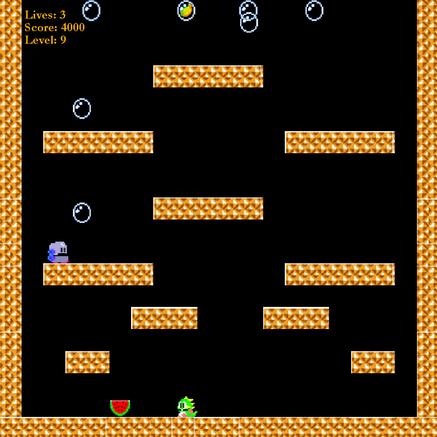

---
date:
  created: 2018-12-10
categories:
  - Projects
---

# Bubble Bobble

Welcome to **Bubble Bobble**: The Java Mid-Life Crisis of Gaming!

Are you a weary traveler on the vast, uncharted plains of the internet, relentlessly searching for something—anything—to stave off the crushing ennui of your existence? Well, my friend, you’ve taken a wrong turn into the back alley of the web, and what’s that lying in a cardboard box? Why, it’s :sparkles:Bubble Bobble:sparkles:, the game no one asked for, brought to you by the coding equivalent of duct tape and prayers!

**Fig 1.** One of the hardest levels in the 8-bit arcade classic Bubble Bobble:tm:

<!-- more -->

Behold, a marvel of modern mediocrity, lovingly crafted in Java SE 17 (because hey, we like to live dangerously too). From the moment you double-click that .jar file, prepare to be whisked away to a world where audio playback sometimes works and the GUI is as intuitive as your uncle trying to understand TikTok.

## Features You Didn’t Know You Didn’t Want:

- **Stunning 2D Graphics**: Featuring cutting-edge pixel art that somehow manages to channel the charm of a 90s' clipart collection.
- **Heart-Pounding Audio**: When it plays, our hand-picked MIDI tracks will take you right back to the glory days of dial-up internet. Enjoy the nostalgia as your speakers dutifully recreate the sound of your computer struggling to keep up.
- **Engaging Gameplay**: Controls that respond almost as quickly as you can press the arrow keys—there's nothing like a slight lag to remind you that life’s all about patience.

## Don’t Just Take Our Word For It!

Here’s what non-existent critics are saying:

- “It’s... a game? I think?” — Anonymous
- “My cat stepped on the keyboard and kinda enjoyed it. 5/10.” — Internet Stranger
- “I laughed, I cried, I wondered why I spent ten minutes downloading this.” — Unwitting Blog Skimmer

## How to Play

- **Download the JAR**: Because nothing says 'safe' like downloading random files from the internet ([Github](https://github.com/eckelsjd/BubbleBobble))
- **Run the Game**: Double-click the JAR file and cross your fingers. Who needs secure installations?
- **Embrace the Chaos**: Navigate through the game using controls that redefine unpredictability.

Despite its many quirks (or perhaps because of them), _Bubble Bobble_ is here to remind you that even in a world of high-definition, meticulously crafted digital experiences, there’s still room for something delightfully... 'handmade'. So, go ahead, take a break from the scroll, and dive into the self-aware silliness of a game that knows just how underwhelming it really is.
