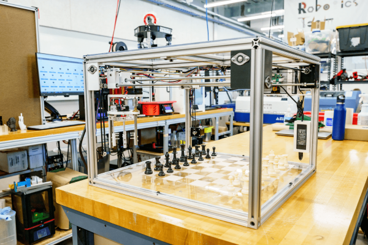
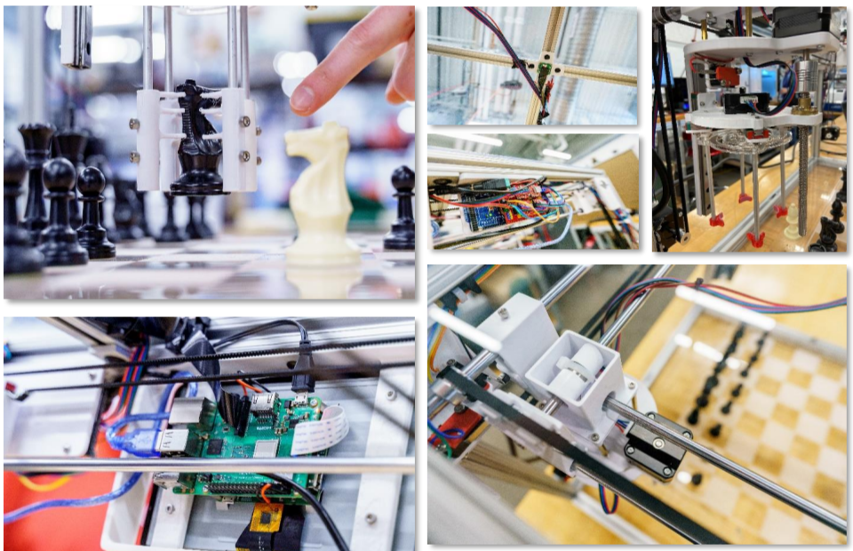

---
date:
  created: 2021-05-05
categories:
  - Projects
---

# Chess robot

**Introducing:** the chess-playing robot that will defeat any opponent who challenges it (mostly because, you know.. Stockfish). The robot is composed of a sleek metal frame and a sturdy acrylic playing surface with a laser-engraved chessboard. A gantry system powered by stepper motors and timing belts moves a claw-like gripper around the board to enact the will of its chess engine AI. Roughly the size of a coffee table and noticeably heavier, this bot is sure to fill out your _entire_ living room with a family-friendly competitive atmosphere.

**Fig 1.** The Chess robot in its natural environment (circa 2021).

<!-- more -->

## Links

- [Chessbot demo](https://youtu.be/P3n7hMYIbRQ) — made for the 2021 Rose show
- [Chessbot code](https://github.com/eckelsjd/ChessRobot) — repository for running the Chess robot

## Project highlights

- AI opponent powered by the Stockfish chess engine :fontawesome-solid-chess-king:
- 3d gantry system for moving the piece gripper (design inspired by 3d printers)
- Arduino microcontroller for motors and sensors
- Raspberry pi for running the chess engine and controller
- Display screen for tracking the game state
- Camera for detecting the game state (and automating the AI opponent's turn)
- Spiral arm piece gripper with smooth acrylic slots for gripper arms
- Laser-engraved acrylic chess board
- Full-size chessboard (which doubles as a coffee table when not in use :coffee:)

**Fig 2.** The chess robot gripper (upper left), controller (lower left), and gantry movement system (right).

## Future work
Given much more sleek chess bots available online, I'd like to revisit this project at some point and turn it into a buildable toy kit. I still like the gantry system idea, but it does make it hard to access the pieces. It's also way too big for the average child (or adult for that matter -- but you should've seen the first version of this bot, which had to be disassembled to even take it out of the room it was built in :melting_face:). So perhaps we shrink the size and simplify the number of moving components. 

I also like the spiral arm gripper, but it's not very consistent. Maybe need to replace the claw design with an easier magnetic-based design. It would also be cool to have an AI opponent that learns to play like you and challenges your weak points to improve your play.
