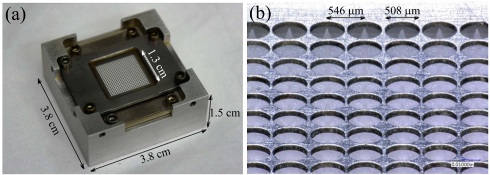
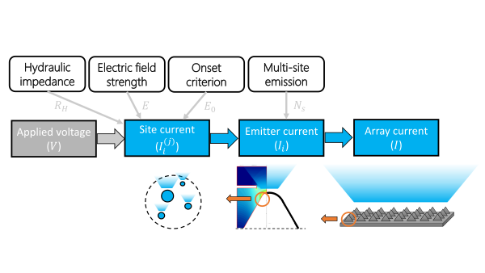

---
date:
  created: 2022-12-28
categories:
  - Projects
---

# Electrospray thruster design

Electrospray thrusters produce thrust by extracting and accelerating liquid ionic droplets from a porous substrate using a strong applied electric field. The task of scaling electrospray thrusters to missions with higher thrust requirements is one of seeking robust designs in the presence of high manufacturing uncertainties in the extractor grid and porous substrate. This project explored Bayesian methods for aiding electrospray thruster design in light of these manufacturing uncertainties.

**Fig 1.** The AFET-2 electrospray thruster (Natisan et al. 2020).

<!-- more -->

## Links

- [Spectral sciences](https://www.spectral.com/our-software/espet/) — ElectroSpray Propulsion Toolkit (ESPET)
- [IEPC paper](https://www.alexgorodetsky.com/static/papers/Eckels_IEPC_2022.pdf) — design space exploration using a neural network
- [SciTech paper](https://arc.aiaa.org/doi/10.2514/6.2023-0066) — optimal experimental design (OED) for model calibration
- [Matlab PDE code](https://github.com/eckelsjd/espet_pde) — electrostatic simulations of electrospray emitters
- [Bayesian OED code](https://github.com/eckelsjd/espet_oed) — experimental design  results
- [Simulation database](https://doi.org/10.7302/v9ay-8e12
) — around 50,000 electrostatic simulation results

## Project goals

- Explore the electrospray design space using a neural network surrogate.
- Apply optimal experimental design (OED) for calibrating an electrospray current emission model.

**Fig 2.** Electrospray array current emission model.

## Contributions

- **Dec 2021** — Automated a Matlab PDE solver for varying electrospray emitter geometries to obtain peak electrostatic field (a key quantity of interest for design).
- **June 2022** — Trained a neural network to learn the electrostatic field as a function of geometry. Used the neural network for sensitivity analysis and design space exploration.
- **Dec 2022** — Implemented and compared three methods for Bayesian OED.
- **Jan 2023** — Applied OED to calibrate the electrospray current emission model (Fig 2).

Further details can be found in the linked conference papers.
