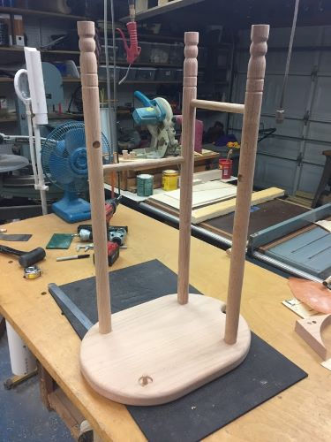
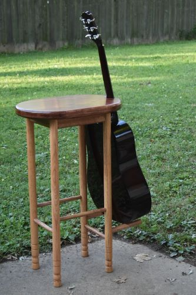

---
date:
  created: 2017-05-28
categories:
  - Projects
---

# Guitar stool

You’ve somehow stumbled upon a post about the creation of an arguably impractical, yet undeniably charming guitar stool. Buckle up, because this tale of woodworking prowess and mild frustration is not just a tale—it’s a journey.

<!-- more -->

Picture this: an oak stool that doubles as a guitar stand. It started as a whimsical side project from my bygone days of guitar-playing glory (kind of). The grand design? A sturdy perch and a cozy nook for my guitar. The reality? A stool that’s comically tall for actual sitting but stunningly effective as a conversation starter.

## The Construction

**Fig 1.** The guitar stool under construction. Note the narrow base, long legs, and complete lack of structural integrity.

- **Materials**: Solid oak for that classy, timeless look. Nothing says “I mean business” like oak.
- **Design**: A notch in the back to hold a guitar. Sure, it sounds simple, but sometimes simple ideas lead to Newtonian glory.
- **Finishing touches**: Sanding it down until it was smoother than my pick-up lines at karaoke night. A glossy stain and a couple coats of polyurethane later, and voila—shinier than my future in carpentry.

## The Final Masterpiece

**Fig 2.** The completed guitar stool. Note: guitar skills will not actually improve upon use.

Imagine a stool so glossy you could check your reflection to see how much your woodworking made you sweat. Functional? That’s debatable. A testament to a fun, overly ambitious side project? Indeed.

So, if you find yourself with an oddly tall stool and a confused look from your friends, remember—you’re not alone :guitar:.
