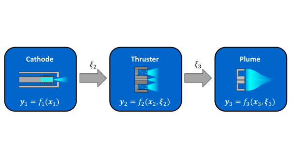
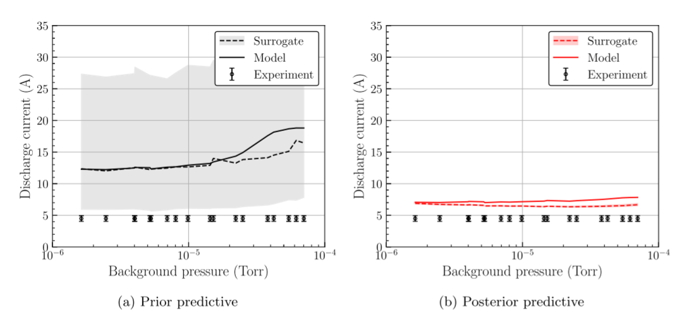

---
date:
  created: 2024-09-27
categories:
  - Projects
---

# Predictive Hall thruster modeling

Hall thrusters are a form of in-space electric propulsion in which a plasma discharge is maintained using crossed electric and magnetic (i.e. $\mathbf{E}\times \mathbf{B}$) fields. Hall thrusters have exploded in popularity in recent years due to their high efficiency and low cost. One of the primary challenges in Hall thruster development is accurately modeling the discharge plasma, especially with respect to the poorly understood physics of electron transport and the coupling of the thruster to its testing environment. These and other related issues introduce large uncertainties to model predictions and prevent the applicability of ground-test data to in-space operation. The ongoing work of the [JANUS institute](https://aero.engin.umich.edu/2021/05/06/michigan-on-team-selected-for-15m-nasa-institute-to-investigate-testing-of-advanced-propulsion-concepts/) is to develop a predictive model of the Hall thruster operating in a vacuum chamber and to reliably make confidence-bounded estimates of in-space performance.

**Fig 1.** The predictive Hall thruster modeling framework (Eckels et al. 2024).

<!-- more -->

## Links

- [Journal article](https://rdcu.be/dVmim) — outlining the predictive modeling and uncertainty quantification framework
- [`hallmd` code](https://www.github.com/JANUS-Institute/HallThrusterPEM.git) — repository for the Hall thruster modeling and analysis tools

## Project goals

- Couple models of the Hall thruster discharge plasma to the test facility.
- Calibrate the models to experimental data through Bayesian inference.
- Perform sensitivity analysis to determine most important aspects of the model.
- Validate models on ground-test data and extrapolate predictions to the in-space environment.
- Assess confidence in predictions through uncertainty quantification.
- Perform experimental design to gather influential data for reducing model uncertainty.

## Current status

This is an ongoing research project within the JANUS institute. Our most recent results are reported in the Journal of Electric Propulsion (see linked article above). We have calibrated a simple cathode-thruster-plume feedforward model on data for the SPT-100 thruster and reduced uncertainty from the prior distributions. However, our model still shows significant discrepancy with experimental data, including in the extrapolation regions. See for example our predictions of discharge current (copied from the journal article):

**Fig 2.** Improvement in predictions of discharge current from the prior to the posterior (Eckels et al. 2024).

We have made several suggestions for improving the model, including revisions to the anomalous transport closure and the coupling between the discharge channel and the plume. We also hope to link a new downstream model for predicting carbon sputter in the vacuum chamber.

## Contributions

- **Dec 2022** — implemented the first version of the multidisciplinary coupled model and ran an initial Monte Carlo analysis on epistemic sources of uncertainty (i.e. the fit coefficients).
- **May 2023** — implemented an adaptive, multi-fidelity, multidisciplinary surrogate building framework [see `amisc`](https://github.com/eckelsjd/amisc.git).
- **August 2023** — automated the surrogate-building infrastructure and applied it to the coupled Hall thruster model.
- **December 2023** — first release of the [`hallmd`](https://www.github.com/JANUS-Institute/HallThrusterPEM.git) code repository, which provides an API for extending models and the testing framework.
- **May 2024** — completed the uncertainty quantification analysis of the Hall thruster model, including Bayesian inference, sensitivity analysis, and Monte Carlo.
- **September 2024** — published the first set of results in the Journal of Electric Propulsion.

Further details can be found in the linked journal article.
