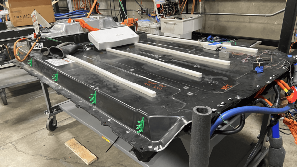

---
date:
  created: 2021-07-31
categories:
  - Projects
---

# High-voltage battery firmware

As part of a summer internship at Tesla on the battery firmware subteam, a series of upgrades to the battery testing infrastructure were underway. A new suite of tests were being developed for the newest Model 3 and semi-truck battery packs. The battery firmware is responsible for interfacing with the vehicle CAN networks, including intercepting and responding to messages involved with charging and discharging the battery, as well as monitoring the battery's state of charge, temperature, performance, and long-term health. Testing the battery firmware involves simulating the vehicle CAN signals to run repeated cycles of charging and discharging, and to purposely fault the system to ensure proper shutdown and recovery.

**Fig 1.** A high-voltage electric vehicle (EV) battery on a testing stand.

<!-- more -->

## Project goals

The primary goal of my internship was to automate large portions of the battery firmware testing framework in Python, as well as to assist in running battery tests for the newest line of vehicles.

## Contributions

- Upgraded 3 (out of 6) battery pack testing hardware units to the newest PCAN interface.
- Automated all state-of-charge firmware tests in the `pytest` framework, using a remote `Jenkins` workflow to trigger sequential regression tests and the collection of CAN traces for determining battery performance.
- Designed and implemented a software abstraction for high-voltage switchbox controllers, allowing multiple vehicle platforms (i.e. Model 3, Model X, etc.) to run on the same testing framework.
- Contributed to various other firmware projects by reviewing pull requests and debugging both hardware and software issues (including a communication issue with the chiller that caused the batteries to periodically overheat during testing :fire_extinguisher:).
